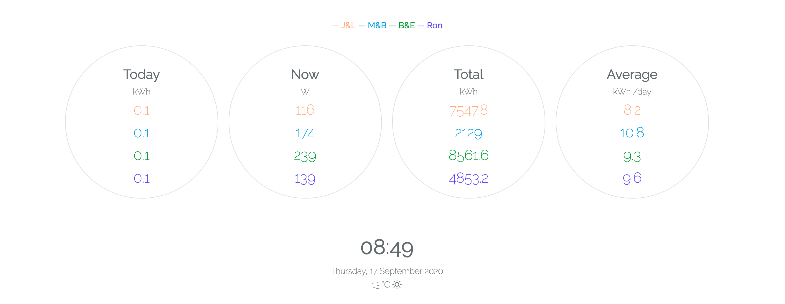
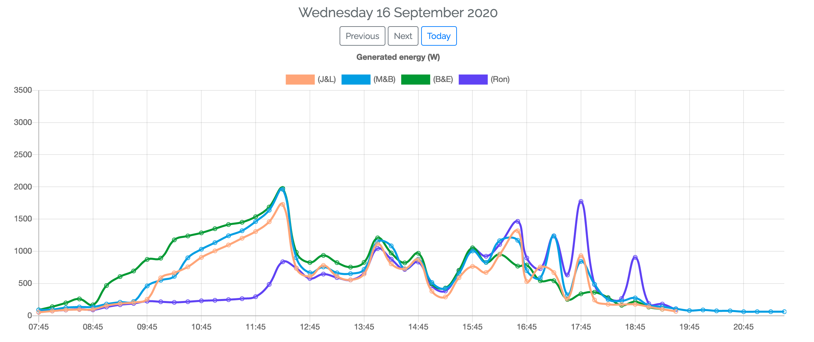
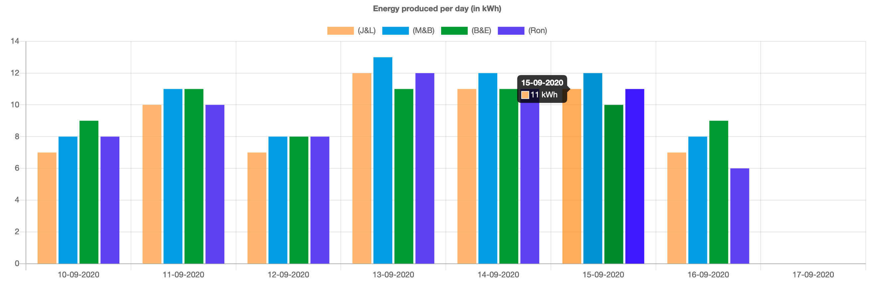

# SunnyDays

This repo contains the code for a hobby project which shows the solar energy produced for the solar panels of myself and my family and puts them together in a single graph.

This site is available at https://sunnydays.johnny.digital.

Since we all have GoodWe converters, the API in this project uses their API to collect the data.

Furthermore, the application stores the weather data for each data entry point, which is collected from Yahoo's weather API. 

## Stack
The application is built with the following technologies.

- Laravel
- Vue
- ChartJS
- Livewire

## Landing page
### Overview
On the top of the page you'll see the currently generated energy for each power station (Photovoltaic unit).

### Graph - Today's yield in time
The current yields of all power stations are shown in a single graph. The data points are collected every 15 minutes from the GoodWe API.

### Graph - Weekly overview

## E-mails
The application sends an e-mail once a day at noon to make sure all systems are operational. Additionally, the application sends an e-mail at the end of the day to report the total produced energy per power station.